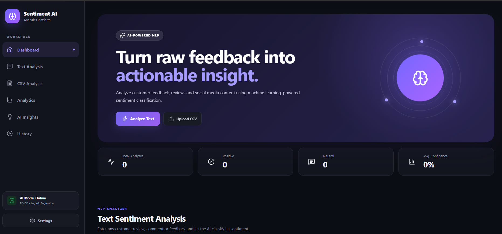

# 🤖 AI-Powered Social Media Sentiment Analyzer         

An AI-powered web application that analyzes text and classifies its sentiment as **Positive, Neutral, or Negative** using Natural Language Processing (NLP) and Machine Learning.

The project combines **TF-IDF Vectorization** with **Logistic Regression** and provides an interactive **React dashboard** with real-time sentiment analysis, confidence scores, CSV bulk analysis, analytics, history, and AI-generated insights.

---
## 🖥️ Project Preview



## ✨ Features

- 🔍 Single-text sentiment analysis
- 🧠 NLP-based sentiment classification
- 📊 Positive, Neutral, and Negative sentiment detection
- 🎯 Confidence score for predictions
- 📈 Sentiment probability visualization
- 📁 CSV bulk sentiment analysis
- 📋 CSV analysis results table
- 📥 Downloadable CSV analysis report
- 📊 Interactive analytics dashboard
- 📜 Analysis history
- 🔎 Search and filter analysis history
- 💡 AI-generated insights
- 🌙 Dark / Light mode
- ⚙️ Settings panel
- 📱 Responsive user interface
- ⚡ FastAPI backend
- ⚛️ React + Vite frontend

---

## 🛠️ Tech Stack

### Frontend

- React
- Vite
- Axios
- Lucide React
- Recharts
- HTML5
- CSS3

### Backend

- Python
- FastAPI
- Uvicorn
- Pandas
- Joblib

### Machine Learning

- Scikit-learn
- TF-IDF Vectorization
- Logistic Regression
- NLP

### Development Tools

- Git
- GitHub
- VS Code

---

## 🧠 Machine Learning Model

The sentiment classification system uses the following pipeline:

```text
Input Text
    ↓
Text Preprocessing
    ↓
TF-IDF Vectorization
    ↓
Logistic Regression
    ↓
Sentiment Prediction
    ↓
Confidence Score + Probabilities